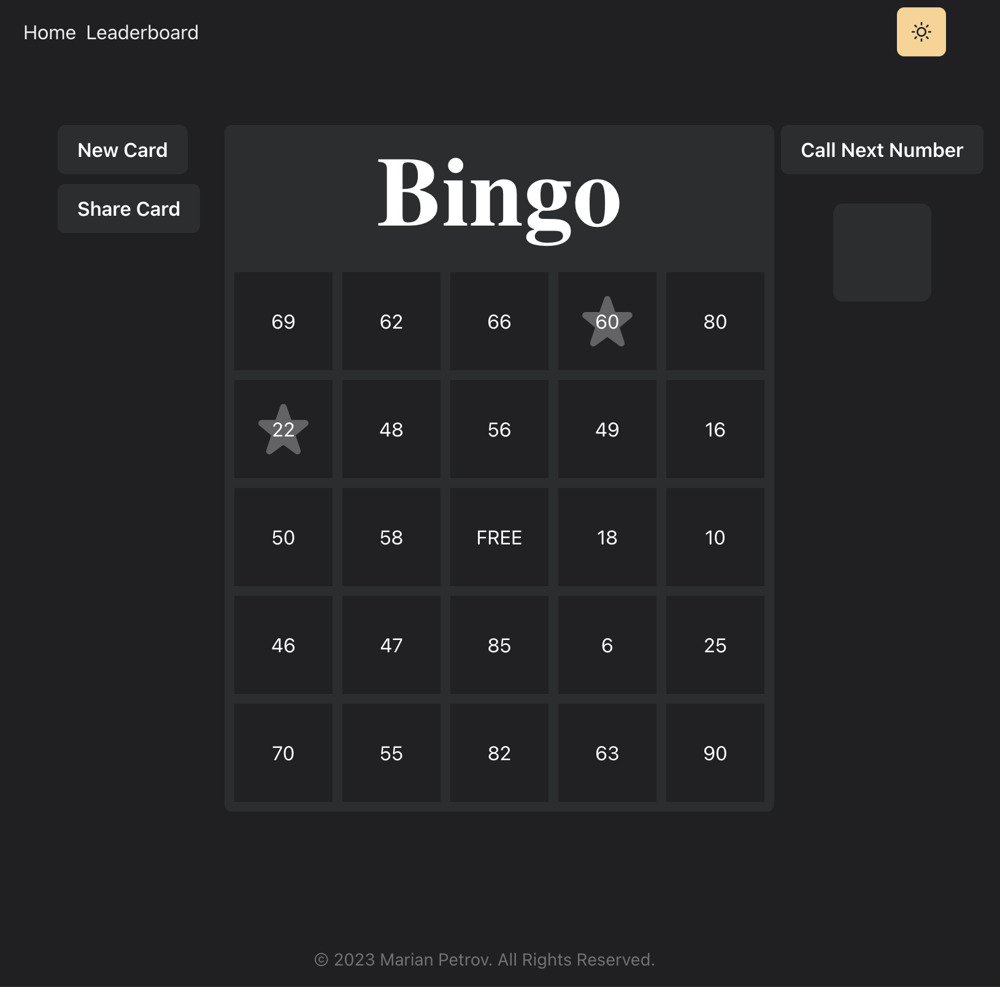
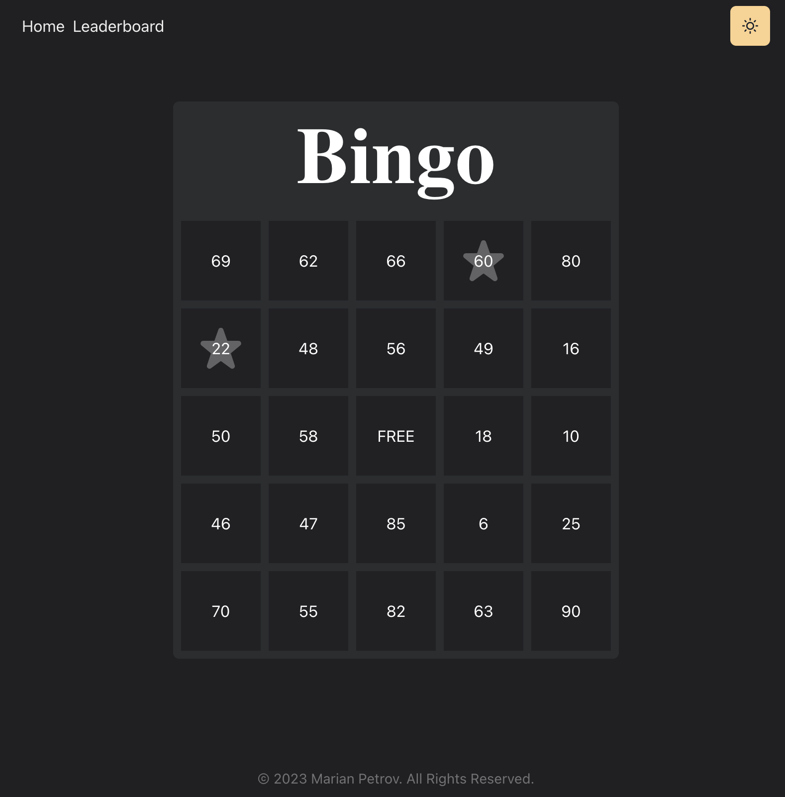
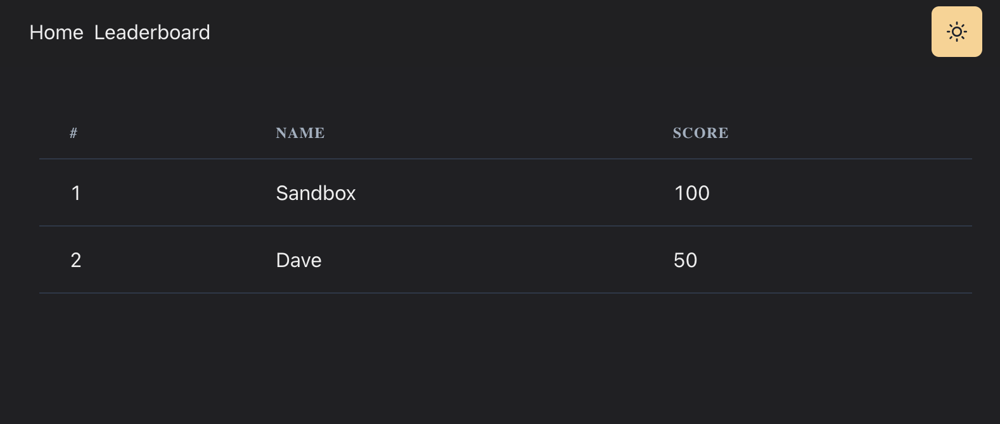

# Bingo

## Screenshots

Board display durring play
# 

Shared card display
# 

Leaderboard display
# 

## Instructions

- clone and follow the instructions how to start the frontend server [https://github.com/bashcole/bingo/](https://github.com/bashcole/bingo/)
- create a `.env` file using `.env.example` as template
- `composer install` to install dependencies
- `artisan key: generate` to generate an application key
- `php artisan migrate` execute all migrations
- `php artisan serve` to start the application
- `php artisan test` to test the application
